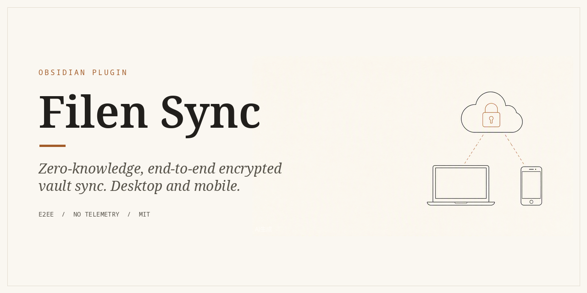

# Filen Sync



<!-- Replace Real-Fruit-Snacks/obsidian-filen-sync with your GitHub path after creating the repo -->


Two-way sync between your Obsidian vault and [Filen](https://filen.io), a
zero-knowledge, end-to-end encrypted cloud storage. Works on **desktop and
mobile**. All encryption happens on your device; your password never leaves
Obsidian and is never stored.

> **Beta software — read the warnings below before your first sync. Test this
> plugin on a COPY of your vault first.**

## What it does

- Two-way reconciliation of your entire vault with a folder in your Filen
  drive (default `Obsidian/<vault name>`), using a persisted three-way base
  state so deletions and conflicts are detected correctly.
- Uploads, downloads, soft deletes (Filen trash / system trash — **nothing is
  ever permanently deleted**), empty-folder sync, conflict handling
  (`keep both` by default, `keep newer` optional).
- **Rename detection**: renaming or moving an unchanged file locally becomes
  a cheap server-side rename/move (content-hash confirmed) instead of a
  delete + re-upload.
- **Version history**: browse a file's Filen versions and restore an older
  one (command palette or right-click a file).
- **Ignored folders**: exclude whole folders from syncing (settings with
  folder suggestions, or right-click a folder) — ignored is never treated as
  deleted, on either side.
- **Memory-only credentials** (optional): never store keys on disk; unlock
  with your password once per Obsidian session.
- **Selective `.obsidian` config sync** (opt-in): sync an allowlist of config
  files (appearance, hotkeys, plugin lists, CSS snippets) between devices.
- **Shared settings** (opt-in): sync a curated subset of settings (conflict
  policy, dotfile rule, ignore patterns, ignored folders, config allowlist)
  between devices via an encrypted file in the remote folder.
- **Dry-run plan preview**: see exactly what the next sync would do —
  uploads, downloads, deletes, renames, folders, conflicts — before
  anything is executed.
- **Setup transfer**: copy your settings (never credentials) to another
  device with a paste-able setup link.
- **Per-file chunk progress**: the progress modal shows live chunk counts
  (`3/7 chunks`) while large files transfer.
- **Explorer "changed since last sync" dots**: files you edited locally
  since the last successful sync get a small accent dot in the file
  explorer; a successful sync clears them.
- **Self-test command**: one click verifies auth, quota, encrypted
  upload/download round-trip and metadata interop against your live account.
- **Parallel chunk transfers**: up to 3 chunks in flight per file for both
  uploads and downloads (order-safe, per-chunk retries unchanged).
- **Fast remote polling**: an events probe (`/v3/user/events`) skips the full
  remote scan when nothing changed remotely; a cached remote tree (max 30
  minutes old) is reused instead.
- **Conflict merge view** (opt-in "ask" mode): side-by-side diff of
  conflicting text files — keep local, keep remote, keep both, or
  concatenate.
- **Sync dashboard**: a sidebar view with connection state, last run,
  conflicts, skipped counts, storage quota and action buttons.
- Syncs on startup, on save (debounced), and every 10 minutes (configurable)
  while Obsidian runs. Manual syncs show a progress modal with a live log
  and a cancel button.
- Mass-change guard: aborts any sync where deletes + modifications exceed 50%
  of your files (configurable), protecting you from wiped remotes and
  misconfigured second devices.

## Requirements & network use

**A paid or free Filen account is required.** This plugin talks to Filen's
public API endpoints — and nothing else:

- `gateway.filen.io` — authentication and file/folder metadata operations
- `ingest.filen.io` — encrypted chunk uploads
- `egest.filen.io` — encrypted chunk downloads

No telemetry, no third-party servers, no analytics.

## Security model

- Filen's zero-knowledge property is preserved: file names, folder names,
  file contents and sizes are encrypted client-side with your account's
  master keys *before* upload (AES-256-GCM; metadata format `002`/`003`,
  1 MiB content chunks, exactly like the official Filen clients).
- Login derives keys from your password (PBKDF2-SHA512 for authVersion-2
  accounts, Argon2id for authVersion-3 accounts). **Your password is used
  only during connect and is never persisted.**
- The API key and master keys are stored **per device** in Obsidian's
  per-device storage (`app.secretStorage` when available, otherwise
  `app.loadLocalStorage`). They never touch `data.json` and are never synced
  to other devices or to Filen beyond the normal encrypted API traffic.
- Optional **memory-only mode** keeps even those keys off disk entirely —
  you unlock with your password once per session instead.
- Deletions on both sides go to trash (Filen trash / OS trash) — never
  permanent delete — so Filen's trash is your safety net.

## Install

### Community directory (coming soon)

Search "Filen Sync" in Obsidian's built-in community plugin browser once the
plugin is accepted. Until then, use BRAT or the manual install below.

### BRAT (beta installs)

1. Install the **BRAT** plugin from the community directory.
2. Run "BRAT: Add a beta plugin for testing" and paste this repository's
   GitHub path. BRAT keeps the plugin updated automatically.

### Manual

1. Download `main.js`, `manifest.json` and `styles.css` from a release
   (or unzip `filen-sync-0.6.0.zip`).
2. Copy them into `<your vault>/.obsidian/plugins/filen-sync/`.
3. Enable Community plugins in Obsidian, then enable **Filen Sync**.

## First run

1. Open **Settings -> Filen Sync**.
2. Enter your Filen email and password (plus your 2FA code if enabled) and
   press **Connect & verify**. The plugin derives your keys, verifies the
   login, and creates/resolves the remote folder
   (`Obsidian/<vault name>` by default — change it before connecting).
3. The first sync runs as a **seed**: if one side is empty everything is
   simply copied (upload-all or download-all); if both sides have files,
   paths that exist on both sides with different content are treated as
   conflicts and both versions are kept
   (`name (conflict YYYY-MM-DD HHmm).ext`). The sync result notice shows how
   many files went each way.
4. Edit a note, wait a few seconds (or run **Filen Sync: Sync now**), and
   check your other device.

Useful commands: `Sync now`, `Sync now (ignore mass-change guard)`,
`Open sync dashboard` (also the ribbon icon), `Browse Filen version history`,
`Unlock Filen sync` (memory-only mode), `Run Filen sync self-test`,
`Reset local sync state`, `Show sync log`.

## Features in detail

### Ignored folders

Add folders under **Settings -> Filen Sync -> Ignored folders** (type-ahead
folder suggestions) or right-click a folder in the file explorer ->
**Ignore in Filen sync**. Ignored folders are completely excluded from
syncing in **both** directions: local changes inside them are not uploaded,
remote changes are not downloaded, and deletions never propagate in or out.
Their sync base records are preserved, so removing a folder from the ignore
list later resumes syncing it cleanly (no conflict duplicates).

### Version history

Run **Filen Sync: Browse Filen version history** (or right-click a file ->
**Filen version history**) to list the versions Filen keeps for the current
file, newest first. **Restore** downloads that version, verifies its
SHA-512, and replaces the local file with the current time as mtime — so
the restored content wins the next sync and propagates everywhere as a new
version (your replaced content stays on Filen as a version, too).

### Memory-only credentials

**Settings -> Filen Sync -> Memory-only credentials**: keys are kept only in
memory and never written to disk. Each Obsidian start begins **locked**
(lock ribbon icon); run **Unlock Filen sync** and enter your password (+2FA)
to unlock for the session. Enabling the toggle wipes any previously stored
keys; disabling it offers to persist the unlocked keys or discard them.
In this mode the remote-tree cache (which contains per-file content keys) is
also kept off disk — it lives only for the session, so the first sync after
each unlock always fetches the full remote tree once.

### Rename detection

When you rename or move a file whose content is unchanged, the sync
compares size + SHA-512 against the remote and performs a server-side
rename/move (no re-upload). Detection is deliberately conservative: if the
content changed, the hash is missing, or more than one candidate matches,
it falls back to a plain delete + upload.

### Sync progress modal

Manual runs (**Sync now**) open a progress modal: phase, progress bar,
op counter, live log tail. **Close** keeps syncing in the background;
**Cancel sync** stops cleanly after the current operation (partial progress
is kept, the next sync resumes). Automatic syncs stay silent.

While a multi-chunk file transfers, a per-file chunk counter appears under
the op counter (`3/7 chunks`) — chunks complete out of order through the
transfer pool, so the counter counts completions, not chunk indices.

### Selective `.obsidian` config sync

**Settings -> Filen Sync -> Sync Obsidian config folder** (off by default)
syncs an allowlist of files inside `.obsidian`. Friendly **preset toggles**
cover the common items — appearance & theme selection, theme files
(`themes`), hotkeys, CSS snippets, community/core plugin lists, and plugin
files (`plugins`) — all enabled by default except `themes` and `plugins`.
A **Custom config paths** box takes anything else (one path per line;
folders sync recursively). Everything not listed stays excluded. Caveats:

- **`workspace.json` (and every `workspace*` file) is never synced**, even
  if you add it to the allowlist — layouts are per-device.
- Config paths always resolve conflicts as **keep-newest** (the loser goes
  to trash, no conflict copies), regardless of the global conflict policy —
  don't edit the same setting on two devices at once.
- Config changes don't fire vault events, so they're picked up on the next
  interval, manual or startup sync — not instantly on save.
- Config files are invisible to Obsidian's Vault API, so the plugin reads,
  writes and trashes them through the filesystem adapter (soft-delete only,
  like everything else).

### Shared settings

**Settings -> Filen Sync -> Share settings across devices** (off by default)
syncs a **curated subset** of settings between your devices via an encrypted
`.filen-sync-preferences.json` file stored directly in the remote sync
folder. The synced keys are exactly:

- **Conflict policy** (`keep both` / `keep newer`)
- **Conflict resolution** (`auto` / `ask` merge view)
- **Exclude dot files** toggle
- **Ignore patterns**
- **Ignored folders**
- **Config sync allowlist** (the allowlist content — the "Sync Obsidian
  config folder" toggle itself stays per-device)

Everything else always stays per-device: credentials and email, the remote
folder, sync intervals and startup/save toggles, the config-sync toggle,
size limits, the mass-change guard, fast remote polling, memory-only
credentials and the debug log.

How it converges:

- Enabling the toggle fetches the remote file: if another device already
  wrote one, its values are applied locally; otherwise your current local
  values become the seed.
- While enabled, changing any of the six keys uploads the file (debounced,
  2 s), and after every sync run a newer remote file is downloaded and
  applied. **Last writer wins** — the `updatedAt` timestamp inside the file
  decides; there is no merging. Don't edit the same shared setting on two
  devices at the same time.
- Each device can set a **Device name** (defaults to the vault name); it
  appears in sync-log lines like `shared settings applied (written by …)`.
- The file itself is never synced as vault content (hard-excluded from
  every scan and plan), is managed only through explicit encrypted
  client calls, and turning the toggle off stops both directions — local
  values stay as they are.

### Dry-run plan preview

Run **Preview sync plan (dry run)** from the command palette (or the
**Preview sync plan** button on the dashboard) to see exactly what the next
sync *would* do — before anything happens. The preview runs the same
scan -> plan pipeline as a real sync but executes nothing: no uploads,
downloads or deletes, no changes to the local sync state, and no progress
modal. The modal shows a counts line (uploads / downloads / deletes /
folders / renames / conflicts), a grouped, scrollable list of every planned
operation in plain language (upload upload, download download, Remove delete here / on
Filen, -> rename on Filen, + folder here / on Filen, (conflict) conflict with its
policy), plus a first-sync (seed mode) note when applicable.

If the mass-change guard *would* stop a real run, the preview says so with
a warning instead of aborting, so you can review the full plan first.
**Sync now** in the preview footer closes it and starts a real sync.

### Setup transfer

**Settings -> Filen Sync -> Setup transfer** copies your configuration to
another device with a setup link (`filen-sync://setup/…`):

- **Export setup** shows a read-only link regenerated from your current
  settings, with a **Copy** button. The link contains the remote folder,
  your email (if set) and the six shared-prefs keys (conflict policy,
  conflict resolution, dotfile rule, ignore patterns, ignored folders,
  config allowlist) — **never passwords, API keys or master keys**.
- **Import setup** on the other device pastes the link and applies it:
  the email (only if none is set locally), the remote folder and the six
  shared keys. Importing never connects and never stores credentials —
  you still enter your Filen password (and 2FA) yourself.

QR code transfer is intentionally out of scope for now — **QR: future**.

### Explorer "changed since last sync" indicators

Files created or modified locally since the last fully successful sync get
a small accent-colored dot next to their name in the file explorer (hover
shows "Changed since last sync"). The dots are a local, visual reminder
only — they don't affect sync decisions. A successful sync (status ok,
including "everything up to date") clears them; a failed or aborted run
keeps them. The decorator watches the explorer with a MutationObserver and
reapplies after Obsidian re-renders the tree; when the file explorer isn't
open (e.g. mobile), it stays quietly out of the way.

### Self-test

**Run Filen sync self-test** checks your connection end to end without
touching the vault or the sync state: account/quota lookup, creation of a
throwaway `filen-sync-selftest-<random>` folder, an encrypted upload ->
download round-trip of 32 KiB random bytes verified by SHA-512, decryption
of the plugin's own metadata, and cleanup (the test folder is trashed —
best-effort even when a stage fails). The modal shows each stage with OK/FAILED
and its duration; the first failure aborts the rest with the exact error.

### Parallel chunk transfers

File chunks (1 MiB each) transfer through a fixed pool of 3 workers, for
uploads and downloads alike. Chunks are index-addressed so completion order
doesn't matter; a failing chunk fails the file (the existing per-chunk
retry/backoff still applies first). Note that Obsidian offers no range-read
API, so whole files are still buffered in memory during transfer — the
default 50 MB size limit (Settings -> Skip large files) is the mitigation.

### Fast remote polling

**Settings -> Filen Sync -> Fast remote polling** (on by default) probes
Filen's events feed after each local scan. When the feed reports **no
changes** since the last watermark, the full remote directory scan is
skipped and the cached remote tree (at most **30 minutes** old) is reused
instead. Safety rails:

- A failed probe **never** trusts silence — it falls back to a full scan.
- Manual **Sync now** runs always scan in full.
- A cache older than 30 minutes is always refreshed.
- While a cached tree is in use, **remote-folder cleanup (pruning) is
  skipped entirely** — cheap insurance against pruning a folder the stale
  cache doesn't know about. File-level logic is unchanged, and the three-way
  base plus trash-only deletes bound the blast radius in any case.

### Conflict merge view (ask mode)

**Settings -> Filen Sync -> Conflict resolution -> Ask** pauses the sync on
each text conflict (UTF-8-decodable, ≤ 1 MiB) and opens a side-by-side
**Local vs Remote** view with line-diff highlighting. Buttons: **Keep
local** (upload; the remote version goes to Filen trash), **Keep remote**
(download; the local version goes to trash), **Keep both** (the default
policy behavior — also what closing the view via Remove does), and
**Concatenate** (local + remote written into the local file and synced as a
new version; the remote file is never trashed). Multiple conflicts queue
sequentially. Binary or oversized files silently fall back to the auto
policy. Note the diff is visual only — with no common base version there is
no auto-merge.

### Sync dashboard

Run **Open sync dashboard** (or click the ribbon icon — it toggles the
dashboard; when memory-only mode is locked it still opens the unlock
prompt). The right-sidebar view shows the connection state and remote
folder, the last run's time/status/summary, conflicts from the last plan,
the skipped/excluded count, and your Filen storage quota with a thin
progress bar (fetched when the view opens and after manual syncs; "quota
unavailable" on failure). Buttons: **Sync now**, **Preview sync plan**,
**Run self-test**, **Open settings**, **Show sync log**. The view refreshes
on open, after each completed run and on settings save — no background
timers.

## Warnings

- **Beta.** Test on a **copy of your vault first**. Keep a backup.
- **Keep Filen-side trash as your safety net** — this plugin only ever
  soft-deletes, so mistakes are recoverable from Filen's trash and your OS
  trash.
- **One sync system per vault.** Do not run this alongside another sync tool
  (Obsidian Sync, Syncthing, iCloud, git…) on the same vault — they fight.
- **Sync only happens while Obsidian runs** (mobile OSes suspend background
  apps). Foreground Obsidian periodically to sync.
- **`.obsidian` is not synced by default** — an opt-in allowlist can sync
  selected config files (see above); `workspace.json` is always excluded.
- **Files larger than 50 MB are skipped by default** (configurable).
- Two files whose names differ **only by case** cannot both sync — the first
  one wins and you get a warning.
- Empty-base first syncs where **both** sides already have files create
  conflict copies for every diverging shared path. If you want a clean
  one-way seed, start with one side empty.

## Known limitations

- **Cross-side case-only renames are still risky.** Local renames of
  unchanged files are detected via content hash, but Filen's backend is
  case-insensitive (names are hashed lowercase), so renaming `Note.md` ->
  `note.md` while another device still has the old casing can produce a
  conflict copy or duplicate instead of a clean rename. Change more than
  the case, or rename on all devices.
- **Rename detection needs the remote content hash.** Files uploaded by
  clients that don't store a SHA-512 in metadata fall back to delete +
  re-upload on rename.
- **authVersion-3 accounts and live-account interop with the official
  Filen clients still require real-account testing.** The wire formats are
  reimplemented from the official `@filen/sdk`, but v3 logins and
  mixed-client vaults have not been verified against production accounts
  yet — test on a copy of your vault first.
- **Config sync is last-writer-wins.** `.obsidian` config paths always use
  keep-newest conflict semantics with no conflict copies, so simultaneous
  edits of the same setting on two devices lose the older edit (recoverable
  from trash). Config changes also don't trigger live sync — they propagate
  on the next scheduled/manual run.
- **Whole files are buffered in memory during transfer.** Obsidian has no
  range-read API (and Node `fs` is unavailable on mobile), so chunk
  parallelism does not reduce peak memory. The default 50 MB per-file limit
  (Settings -> Skip large files) is the mitigation.
- **The events cache can be up to 30 minutes stale.** Fast remote polling
  reuses a cached remote tree while Filen's events feed is quiet. If the
  feed itself ever misses a change, the cache is at most 30 minutes old, a
  failed probe forces a full scan, remote-folder pruning is skipped for
  cached trees, and manual syncs always scan in full — plus the three-way
  base and trash-only deletes bound any mistake.
- **No automatic content merge.** Conflicts between text files can be
  resolved interactively in ask mode, but the diff is visual only: a two-way
  sync has no common base version, so a correct three-way auto-merge is
  impossible — you pick a side (or concatenate) explicitly.

## Non-goals

No live/realtime sync, no background sync while Obsidian is closed, no
automatic merging of conflicting file contents, no shared-vault or
public-link features.

## Troubleshooting with the debug log

When something goes wrong, enable **Settings -> Filen Sync -> Debug log**, then
open the developer console and reproduce the problem:

- **Desktop:** `Ctrl+Shift+I` (Windows/Linux) or `Cmd+Opt+I` (macOS) -> Console tab
- **Android:** `chrome://inspect` on a connected desktop (USB debugging)
- **iOS:** Safari -> Develop menu -> Web Inspector (macOS required)

Every line is prefixed `[filen-sync]` and tagged by area:

| Tag | What it shows |
|---|---|
| `[auth]` | connect-flow steps (auth version detected, login ok, keys ok) |
| `[http]` | every request: method, endpoint, HTTP status, duration, retry attempts, server error code/message |
| `[transfer]` | uploads/downloads: file, size, chunk count, SHA-512 verify result |
| `[sync]` | engine: tree sizes, plan summary (`3upload 1download 0 deletes…`), conflicts, guard aborts, errors |

**Never logged:** your password, derived keys, API token, master keys, DEK,
file keys, upload keys, request bodies, or `Authorization` headers. Vault file
paths **are** included — don't paste logs into public places without reviewing
them first. Debug mode also records verbose "info" entries into the persisted
sync log (command: *Filen Sync: Show sync log*). Turn the toggle off again for
daily use.

## Development

```sh
npm install
npm run build   # tsc type-check + esbuild production bundle (main.js)
npm run test    # vitest: crypto, planner decision table, client request shapes, utils
npm run lint    # eslint + eslint-plugin-obsidianmd
npm run package # build + dist/filen-sync/ + dist/filen-sync-0.6.0.zip
```

The Filen client is a minimal pure-TypeScript reimplementation
(WebCrypto + `requestUrl` + `@noble/hashes`) because `@filen/sdk` pulls in
Node builtins that crash Obsidian mobile. Wire formats and design decisions
are documented inline in `src/filen/` and `src/sync/`.

## License

MIT — see `LICENSE`.
